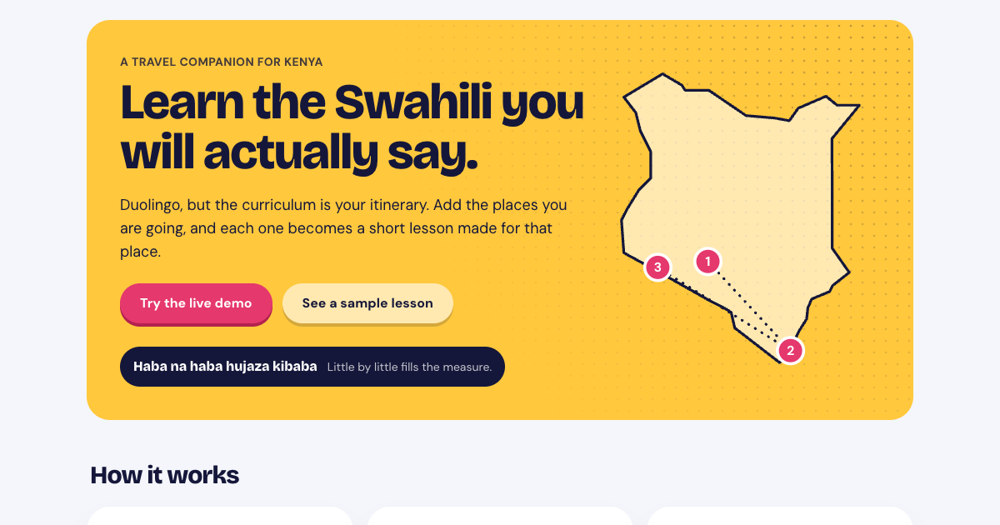
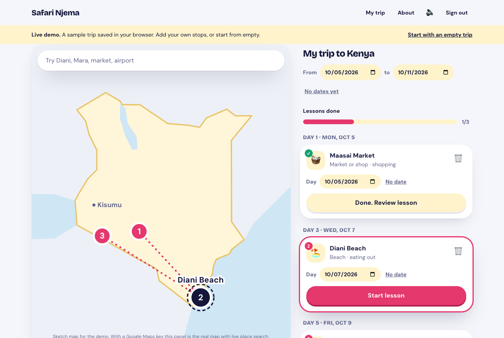
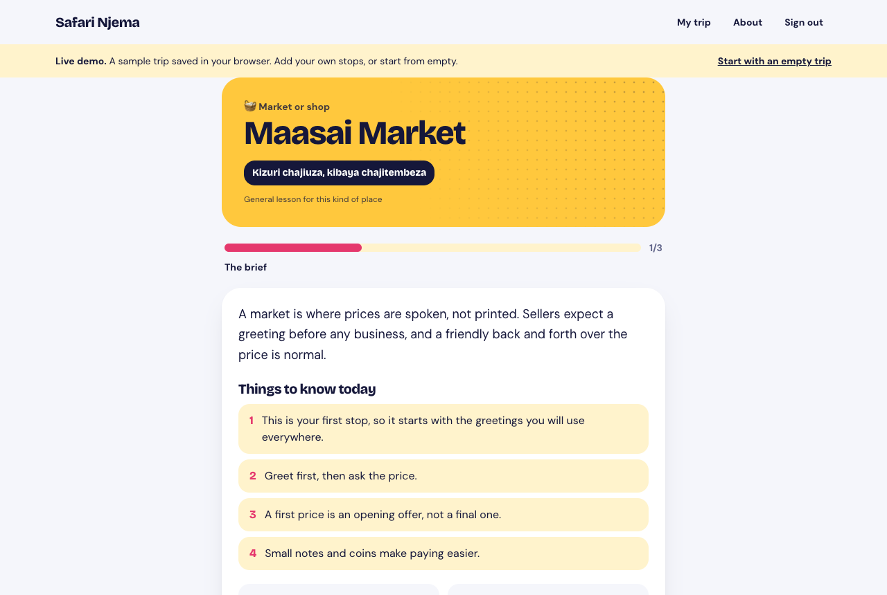
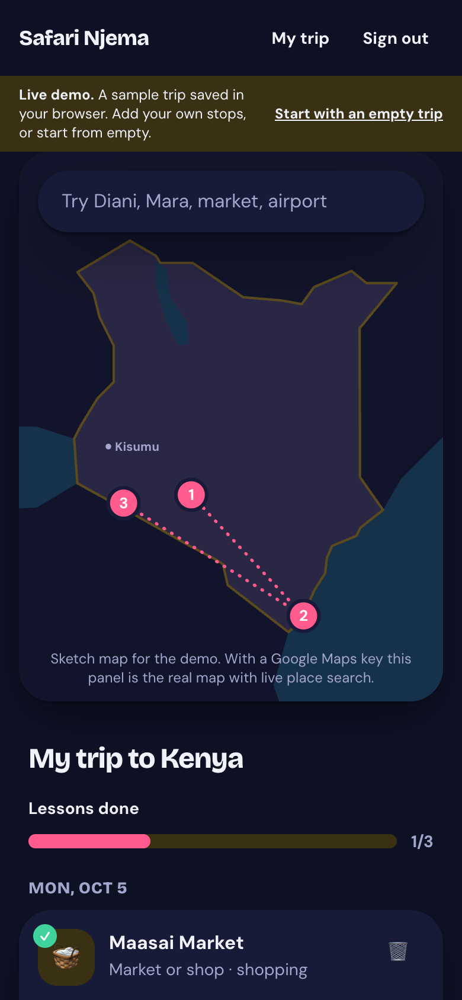
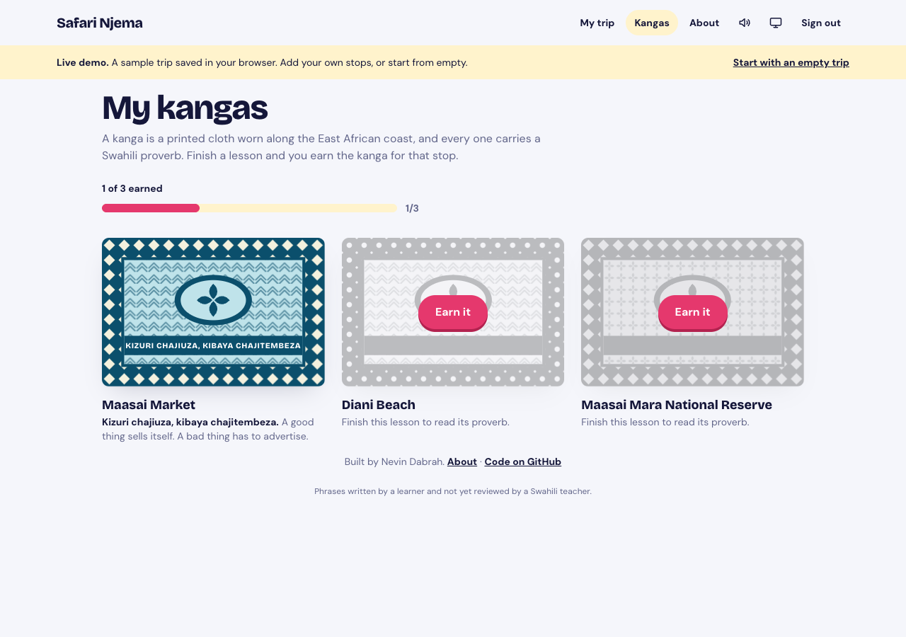

# Safari Njema

**A travel companion for Kenya. Add the places you are going and get a short Swahili lesson made for each one.**

You add the places you are going. Each stop becomes a five minute Swahili lesson made for that place: a brief on what to know, the phrases you will need there, and a quiz. A market teaches prices and bargaining. A beach teaches coast words and ordering. A game reserve teaches the animals your guide will call out.

**Live site:** https://safari-njema-rust.vercel.app. Create an account, or sign in with Google.



| The trip planner | A finished lesson earns a kanga | On a phone, dark mode |
|---|---|---|
|  |  |  |



## The demo and the full product

Safari Njema is designed around **Google Maps Platform** and the **Claude API**. The public demo runs without API keys so it costs nothing to keep online, and it stands in for them like this:

| Part | In the demo | With the keys switched on | Where the code is |
|---|---|---|---|
| Map and search | A sketch of Kenya and a catalogue of 51 built-in places, searchable by intent | Google Maps JavaScript API for the map and pins. Places Autocomplete, limited to Kenya, with session tokens and only six billed fields | `src/features/trip/TripMap.tsx`, `usePlaceSearch.ts` |
| Lessons | A template picks phrases from the bank and adds a general brief | The Claude API writes the brief for the exact place and chooses phrases from the bank. JSON is validated with zod, retried once, then falls back to the template | `supabase/functions/generate-lesson/claude.ts` |
| Accounts and data | One demo account in the browser | Supabase Auth, Postgres with Row Level Security, and an Edge Function that keeps the Anthropic key on the server | `supabase/migrations/`, `generate-lesson/index.ts` |

The switch is automatic. With no keys the app is the demo. Add the Supabase values and it becomes the real product with accounts, add a Google Maps key and the sketch becomes Google Maps, set `LESSON_AI_ENABLED=true` with an Anthropic key and Claude writes the lessons.

## Why it is interesting

- **Lessons come from a phrase bank, not free text.** Language models make mistakes in Swahili, so the model may only choose from 95 phrases, each tagged by hand. It picks and explains. It does not invent.
- **An AI switch.** With it on, Claude writes the brief and picks phrases, and its JSON is validated with zod. With it off, a template builds the lesson from the same candidates. The live site runs with it off, so it costs nothing to host.
- **One pipeline, two runtimes.** Scoring, the slot plan and the template are pure TypeScript. The same files run in a Supabase Edge Function and in the browser demo.
- **A Swahili voice, checked by a machine that understands Swahili.** Every phrase is spoken by Meta's MMS text to speech model for Swahili. A script records many takes of each phrase, a Swahili speech recogniser listens to every take, and the clearest one is kept. Short words are the hard case, because the voice was trained on sentences. For those the word is spoken three times and the middle one is cut out using the model's own timing, which rescued words like Bahari and Kiboko. A clip the recogniser still could not understand is held back, and that phrase says "Audio coming soon" until a person records it. What was heard for every clip is in `docs/audio-report.json`. No speech service and no key at run time.
- **Built to be corrected.** A public phrasebook lists all 95 phrases with their pronunciation guide and recording, and marks the four phrases whose recording is still to come, so a Swahili speaker can judge them by ear. They leave a note beside any phrase and send all their notes at once by email, copy or file. No account and no server.
- **Accessible colour, tested.** A test reads the real stylesheet and checks every text and background pairing in light, device dark and toggle dark against the 4.5 to 1 standard. It also fails if the two dark themes ever differ, which is the bug that once made answer feedback unreadable.
- **Reviewed Swahili.** All 95 phrases have been reviewed by a Swahili teacher. Anything a model proposes later is marked unreviewed until someone checks it.
- **A look that belongs to the subject.** Every finished lesson earns a kanga, the printed cloth that always carries a Swahili proverb, drawn in SVG from six colourways and four motifs. The icons are the app's own line set, not emoji. Light, dark or follow the device, with no flash on load.
- **Real photos, properly credited, served by the site itself.** A script resolves one freely licensed Wikimedia Commons photo per place, saves the author and licence, then downloads each photo once and keeps two compressed sizes. No page waits on a third party, and the landing page's photos went from 832 KB to about 90 KB. Every photo is credited where it is shown and on the About page.
- **Tests that read the lessons.** 130 unit tests. They assert the exact phrases for a market, a beach and a game reserve, then sweep every kind of place so the bill never shows up at an airport.
- **Row Level Security on every table, and tested.** `scripts/testDatabase.mjs` runs the real `setup.sql` in an in-process Postgres and proves that one user cannot read, change or write into another user's trip, stops or lessons, and that nobody can write to the shared phrase bank.
- **Accounts that work before any server code is deployed.** If the Edge Function is absent, a signed in user's lesson is built in their browser by the same pure functions and saved into their own row. The function is only needed for lessons written by Claude.
- **Fast first load.** The demo build drops the Supabase library entirely, since the bundler can see at build time that it is unused. Libraries are split into their own long-cached files, the next screens' code is fetched while the browser is idle, and a lesson's recordings are fetched as it opens so a tap plays at once.
- **Written to be read.** One feature per folder, no file over 200 lines, and every file opens by saying what it does and why it exists.

Try it in thirty seconds:

```
git clone https://github.com/nevindabrah/safari-njema.git
cd safari-njema
npm install
npm run dev
```

With no keys at all, this runs the full demo. The product requirements are in `safari-njema-prd.md`.

## Architecture in five sentences

The frontend is a Vite and React site deployed on Vercel, with every screen listed in `src/routes.tsx`. Supabase provides the database, email and password login, Row Level Security so users only see their own rows, and one Edge Function. When a stop is added, the browser calls the `generate-lesson` Edge Function, which picks candidate phrases from the phrase bank by matching tags to the place type, activities and region. If the AI switch is on, Claude writes the brief and chooses the phrases from those candidates; if it is off or anything fails, a template lesson is built from the same candidates with no model call. Lessons are cached in a shared `lessons` table and each user gets a `user_lessons` row pointing at one.

## How a lesson is generated

```
browser                     generate-lesson (Edge Function)                     database
-------                     -------------------------------                     --------
add stop  ──rpc──────────▶  add_trip_stop upserts place, inserts stop  ──────▶  places, trip_stops
invoke ───────────────────▶ 1. check the stop belongs to the caller
                            2. load place type, region, activities, level  ◀──  profiles, trip_stops
                            3. first stop of the trip? then greetings are in
                            4. pick 40 candidate phrases by tags            ◀──  phrases
                            5. cache check by place + activities + level    ◀──  lessons
                            6. LESSON_AI_ENABLED=true? ask Claude for JSON,
                               validate with zod, retry once
                            7. otherwise build the template lesson
                            8. save lesson, save user_lesson, mark ready   ──▶  lessons, user_lessons, trip_stops
lesson ready ◀───────────── { user_lesson_id, lesson }
```

The pure parts of this (candidate picking, the template, the quiz) have Vitest tests and no network calls. One test file runs the acceptance-test stops against the real seed with the exact phrases expected, then sweeps every kind of place in three regions to check phrases stay where they belong.

## Setup

The app runs as the demo with no setup at all. To turn on accounts and server side lessons, follow **[docs/SETUP.md](docs/SETUP.md)**. In short:

1. **Supabase.** Create a project, paste `supabase/setup.sql` into the SQL editor once, and put the project URL and anon key in `.env`. That alone is enough for people to create accounts. That one file holds every table, every Row Level Security policy, both database functions, and the 95 reviewed phrases and 10 proverbs.
2. **Sign in.** Email and password works out of the box. For "Continue with Google", create an OAuth client in Google Cloud and paste its ID and secret into Supabase. The guide gives the exact redirect addresses.
3. **Edge Function, optional.** Only for lessons written by Claude. `npx supabase functions deploy generate-lesson`, then set `LESSON_AI_ENABLED` and, if it is on, `ANTHROPIC_API_KEY` as Supabase secrets.
4. **Check.** `npm run check:supabase` reads `.env` and reports, line by line, whether each table exists, whether Row Level Security hides rows from strangers, whether email and Google sign in are on, and whether the function is deployed.
5. **Google Maps.** Optional at first. Without a Maps key the planner uses the sketch map and the built-in places, so accounts and lessons can be tested before Google Cloud is touched. With one, enable Maps JavaScript API and Places API (New), restrict the key to your domains, and create a Map ID.
6. **Vercel.** Import the repo and add the `VITE_` values. `vercel.json` already rewrites every path to `index.html` for React Router.

## Demo mode: the whole product with no accounts and no keys

The app runs in demo mode when the Supabase values are missing, and also when a visitor on a site with accounts presses "Try the demo, no sign up". This is what the live demo link shows.

- The landing page has one button, "Try the live demo". It opens a ready-made trip: Maasai Market, Diani Beach and the Maasai Mara, each with its own lesson.
- A built-in catalogue of 51 well known Kenyan places. Search it by name or by what you want to do: "food", "eating" or "hungry" finds restaurants, "animals" finds parks, "swim" finds beaches, "train" finds stations. Typos are forgiven, so "restaruants" works, and "Paris" still finds nothing.
- Or skip typing. "Browse places" opens the whole catalogue as photo cards, grouped into safari and nature, beaches, food, markets, towns, culture, places to stay and getting around. Places already on the trip are marked.
- Add a place with a day and activities. It appears as a numbered pin on a sketch map of Kenya and as a row in the itinerary, with the "Preparing your lesson" state. Stops in the same town fan out into a ring so each pin can be clicked, and picking a pin shows its name and rings its row.
- Lessons are built in the browser by the same pure functions the Edge Function uses, from the same seed phrases. The first stop teaches greetings and later stops do not. Each lesson carries a Swahili proverb from the seeded list, the kanga idea.
- Every lesson starts by asking how long you have: Quick (3 minutes, 4 phrases), Standard (5 minutes, 6 phrases) or Deep (10 minutes, 8 phrases). A lesson holds eight phrases in priority order, so a shorter one studies the first few. The choice is remembered.
- Practice mixes eight kinds of exercise in three parts that get harder: recognise (meaning, true or false, match the pairs), recall (English to Swahili, sounds like), and produce (build the sentence from word tiles, fill the gap, type the answer with one typo forgiven). Wrong answers come from the whole phrase bank, a streak counter rewards runs, and anything missed comes back once in a second chance round. Only first tries count.
- Dates are free. Trip dates can be set, changed or cleared at any time. A stop can take any date, inside the trip or not, and can be moved to another day later. The list and the pin numbers follow the dates.
- Sound effects for taps, right and wrong answers, a new stop and a finished lesson. They are made with Web Audio, so there are no audio files, and the speaker button in the top bar mutes them for good.
- Every phrase can be played aloud: on the phrases step, on the pocket card, and automatically after each answer. Practice includes listening exercises, where you hear a phrase and pick what was said. The speaker button in the top bar turns the automatic playback off.
- The phrasebook at `/phrasebook`, the privacy page at `/privacy`, and a friendly page for unknown addresses are all public.
- During a lesson the tab bar and the demo strip step aside, and the feedback scrolls into view after each answer, so the Next button is never hidden on a phone.
- Every stop has a pocket card: all its phrases with pronunciation, the three things to know, the etiquette note and Kenya's emergency numbers, on one page that prints cleanly.
- The kanga shelf shows a cloth for every lesson. Unearned ones are veiled and keep their proverb hidden until the lesson is finished.
- There is always a way out. The logo in the top left goes home from anywhere. Every secondary screen has a back arrow, every card, sheet and lesson has an X, the demo strip can be put away, and every search box has an X that clears it (`src/components/Logo.tsx`, `LeaveButton.tsx`, `SearchBox.tsx`).
- Navigation on every screen size: on a phone, a menu button in the top bar opens a sheet listing every screen, and the bottom tabs show for visitors who are not signed in as well as those who are. From 640 px up the links sit in the top bar. Checked on phones at 320, 360 and 390 px wide: no sideways scrolling, every button at least 40 px tall, and form text at 16 px so iPhones do not zoom in on focus. On a phone a picked place opens as a bottom sheet with "Add to itinerary" always in view, and once a lesson starts its photo shrinks to a slim strip so the answers fit on screen.
- Dates are picked on the app's own calendar, not the browser's: a rounded month of round day buttons, Monday first, with the trip's days tinted (`src/components/DatePicker.tsx`, `CalendarSheet.tsx`, arithmetic and tests in `src/lib/calendar.ts`). It opens as a bottom sheet on a phone and a small card on a laptop.
- A "Telling time" screen at `/time`, linked from the top bar, the phone tabs, the landing page and the phrasebook: why 7 am is hour one, the add or take away six rule, and an interactive clock (`src/features/time/`, `src/lib/swahiliTime.ts`). The clock has two rings of numbers, the watch hour outside and the Swahili hour inside, so the hand points at both at once. It has an hour hand and a minute hand that moves in fives: choose which hand is live, then tap a number or drag it. Minutes are said the Swahili way, added to the hour up to half past (na robo, na nusu, na dakika) and taken away from the coming hour after that (kasorobo, kasoro dakika). Switch am and pm. Under every time is a pronunciation guide in the phrasebook's style, for example SA-a m-BI-li na RO-bo a-su-BU-hi. Every one of the 288 times, and "Saa ngapi?", also has a recording behind a speaker button. `scripts/generateTimeAudio.py` makes them with the same voice and the same machine check as the lesson audio, from a list printed by the app's own code (`scripts/listTimePhrases.ts`). What the recogniser heard for each is in `docs/time-audio-report.json`. A clip is fetched only when its button is pressed, so the 5.9 MB of recordings add nothing to page load. A practice mode names a time in Swahili and asks the learner to set the clock. Nevin reviewed the time words and recordings on 22 September 2026.
- Light and dark are held to the same standard. Every box you can type in shares one `field` style with a filled background and an edge that reaches 3 to 1 against the card in all three themes, and inner panels use a `--surface-2` that can be seen on a white card. `src/lib/theme.test.ts` checks these pairs, and a scripted run solves a whole Deep lesson, all nine exercise kinds, in light and in dark.
- Usernames, friends and shared trips (migration 0007). Every account has a unique username, chosen at sign up or, for Google accounts, on a welcome step; it can be changed on the account page. You can log in with your username or your email: a database function checks the password against Supabase's own hash with pgcrypto and only then reveals the email, and five wrong tries lock the username for 15 minutes. Google accounts can set a password too. The friends screen at `/friends` searches usernames by prefix, and requests are asked, accepted or ended in one `friendships` table. A trip's owner can invite accepted friends, who then see the trip, add stops and get their own lesson for every stop, while only the owner changes the dates. All of it is Row Level Security plus a few security definer functions, checked by 52 tests in `scripts/testDatabase.mjs`.
- A teacher's page at `/teacher` (migration 0008). Anyone reading the phrasebook can press "Send to the teacher" and their notes go into a `phrase_notes` table, with no account needed. Only a profile marked `is_teacher` can read the notes, grouped by phrase, and mark each one handled. The email, copy and file ways of sending still exist for a site with no database.
- A Today card at the top of the itinerary: the stops on today's date with their lesson, the next stop on a free day, or a countdown before the trip. The decision is one pure function, `src/lib/todayPlan.ts`, tested for every kind of day.
- Spaced repetition. Finishing a lesson or a review records each phrase in `phrase_progress` with Leitner boxes (`src/lib/spacedRepetition.ts`: 1, 3, 7, 14 then 30 days; a miss drops to box one). The Today card says how many phrases are due, and `/review` builds a practice from them with the same exercise engine as lessons. In the demo the progress lives in localStorage.
- Badges. A count on Friends for requests waiting, and on My trip for trips a friend shared since you last looked (`src/features/friends/useBadges.ts`).
- Checks on every push. `.github/workflows/ci.yml` runs the type check, lint, unit tests, build, the database rules in an in-process Postgres, and the browser tests. The browser tests use Playwright, added on 22 September 2026 as the one dependency outside the PRD's list: it drives a real Chromium through the demo build (no keys, no network) on a phone, a tablet and a laptop viewport, finishes a whole lesson using the seed phrases as the answer key, and catches the kind of bug unit tests cannot, such as a hidden button or a wrong verdict. Run them with `npm run test:e2e`. A second set in `e2e/live/` runs only on request, `LIVE=1 npm run test:e2e`, against the Supabase project in `.env`: sign up with a username, log in by username, change it, the welcome step for an account that arrives without one, and two friends sharing a trip. Every account it creates, it deletes. Add `LIVE_URL=https://safari-njema-rust.vercel.app` to run the same tests against the live site.
- A food page at `/food`: 14 everyday Kenyan dishes, each with a photo chosen so the dish is the subject, how to say its name with a recording judged the same way as the lesson audio, what it is, how people eat it and where you meet it. The notes are in English and say so. `scripts/generateDishAudio.py` makes the recordings; names the recogniser could not follow say "Audio coming soon".
- An account page at `/account`, reached from the person icon in the top bar: who is signed in, sign out, and "Delete my account", which calls one database function that removes the auth row and, through cascades, everything else (migration 0006). In the demo it clears the browser's saved trip.
- Laptop users can answer with the number keys and move on with Enter. On a phone the main links sit in a floating tab bar within thumb reach.
- Finish a quiz and the stop turns green and the trip's progress bar moves. "Start with an empty trip" clears the sample so the first stop flow can be tried from scratch.

Demo data lives in the browser's localStorage. Once the Supabase values are set on Vercel the site has real accounts, and the demo stays as a second way in: the choice is saved in the browser and read once when the page loads, and entering or leaving the demo reloads the page (`src/features/demo/demoMode.ts`). The code is in `src/features/demo/`, and each data hook switches to it with one `if (isDemoMode)`.

What demo mode cannot show: real sign up and login, the real Google map and search, and Claude written lessons. Those need the setup above.

To put the demo online: go to vercel.com/new, import this repository and press deploy. No environment variables are needed. `vercel.json` already sends every path to `index.html`.

Then locally:

```
cp .env.example .env    # fill in the four VITE_ values
npm install
npm run dev             # http://localhost:5173
npm test                # Vitest
npm run build           # type check and production build
```

## The voice and its licence

`python scripts/generateAudio.py --judge` makes `public/audio/*.m4a` and `src/features/audio/audioManifest.json`. The voice is `facebook/mms-tts-swh` and the listener that judges each take is `facebook/mms-1b-all` with its Swahili adapter. Both are Meta's MMS models under **CC BY-NC 4.0**: free for non-commercial use with credit, which suits a student project. Nine other Swahili voices on Hugging Face were tried against the same listener. The main voice is the clearest overall, so it speaks 87 of the 91 clips in the app. Adding `--only-weak --other-voices` lets other voices try only the clips that are still weak, and one replaces the main voice only when the listener hears it almost perfectly: four clips come from `Mwau/waxal_swahili-tts-mms` (CC BY-NC 4.0) and `mussacharles60/swahili-tts-female-voice` (MIT). Voices with no stated licence were tested but not shipped, even where they won: `khof312/mms-tts-swh-female-1` and `-2` say Simba, Angalia and Hujambo? / Sijambo perfectly, and could be used if their author confirms a licence. `docs/audio-report.json` records which voice and settings made every clip. If Safari Njema ever earns money, the clips must be regenerated with a commercial voice, for example an Azure `sw-KE` neural voice, which is what the PRD first planned. The script needs Python with torch, transformers and scipy, and macOS for `afconvert`. It is a one time build step, not a dependency of the app.

## Photos and their licences

`node scripts/fetchPlacePhotos.ts` gathers candidates for each built-in place, the lead photo of its Wikipedia article plus a Wikimedia Commons search, and prefers a wide landscape photo at least 1,400 px across, because every place appears in a frame wider than tall. It downloads the chosen photo at up to 2,000 px and saves three sizes (1,600, 960 and 480 px wide) into `public/places`, never upscaling, and writes `src/features/places/placePhotos.json` with the author, licence and source page. The app serves them with `srcset`, so a phone gets the 960 px file and a laptop hero the 1,600 px one. `scripts/fetchDishPhotos.ts` does the same for the food page. It skips anything that is not on Commons, which is how fair use logos are kept out. Photos found by search are marked illustrative and credited that way. The app never looks photos up at runtime, so a visitor cannot be rate limited.

## Decisions and backlog

`docs/DECISIONS.md` records every decision of substance, why it was made, what else could have been done and the trade-off. `docs/BACKLOG.md` lists what is left, in order, and what is deliberately not being done.

## Environment variables

| Name | Where | What |
|---|---|---|
| `VITE_SUPABASE_URL` | `.env`, Vercel | Supabase project URL |
| `VITE_SUPABASE_ANON_KEY` | `.env`, Vercel | Supabase anon key, safe in the browser because RLS is on |
| `VITE_GOOGLE_MAPS_KEY` | `.env`, Vercel | Google Maps key, restricted by domain and API |
| `VITE_GOOGLE_MAP_ID` | `.env`, Vercel | Map ID for the styled map and custom pins |
| `VITE_FEEDBACK_EMAIL` | Vercel | Optional. Where phrasebook notes are emailed. Left unset, the email opens with no address |
| `LESSON_AI_ENABLED` | Supabase secret | `true` or `false`. The live site runs with `false` |
| `LESSON_MODEL` | Supabase secret | Claude model name, default `claude-opus-5` |
| `ANTHROPIC_API_KEY` | Supabase secret | Never in `.env`, never under `src/` |

`.env` is git ignored. Only `VITE_` variables reach the browser.

## The AI switch

Lesson generation with Claude is fully built in `supabase/functions/generate-lesson/claude.ts`. On the live site `LESSON_AI_ENABLED` is `false`, so every lesson comes from the shared cache or from the template in `supabase/functions/_shared/template.ts`. The lesson screen says which kind it is: "Written for this place" or "General lesson for this kind of place". To demo live generation, set the switch to `true` with a key.

Still to do for this: run the AI path end to end once, record it, and pre-generate lessons for about 20 popular places (PRD 7.3a).

## Demo account on the real backend

The browser demo already gives visitors a no sign up way in, including once accounts are on. The PRD also asks for a shared demo login on the real backend, which is still to do. To create it: sign up an account on an address Nevin controls, add three stops, then in the SQL editor set `is_demo = true` on its `profiles` row so it cannot generate new lessons. Then print the email and password here and on the landing page.

## What is built

The 22 September cut, in the PRD's order:

1. Vite, React, TypeScript, Tailwind v4 with every colour, radius and shadow as a CSS variable in `src/index.css`. Light and dark follow the device.
2. Supabase schema for every table in the PRD, RLS on all of them, email and password sign up and login.
3. One trip is created automatically the first time a user opens the planner. No onboarding.
4. The trip planner: Google map, Kenya-only search with session tokens, preview card with day and activity chips, numbered pins, a route line, the itinerary list, delete.
5. `generate-lesson` with the template path and the Claude path behind the switch, daily limit of ten, demo account blocked.
6. The three step lesson: brief, phrases, quiz. The quiz builder is a pure function with tests.
7. About page, a note that the phrases have been reviewed by a Swahili teacher, this README.
8. Demo mode, described above: a seeded trip, a sketch map of Kenya, completion and progress, and a proverb on every lesson.
9. A public sample lesson at `/preview` for the three acceptance-test stops, so a visitor can see a lesson without an account. The trip and lesson screens load on demand to keep the landing page small.

Built since the deadline: Google sign in and password reset, the theme toggle, audio, varied practice, lesson lengths, kangas, pocket cards and photos. Still to do: the Today screen, onboarding, speaking practice, spaced repetition, pre-made Claude lessons, and running the Claude path against the live API.

## How it works, in plain language

- `src/features/trip/usePlaceSearch.ts` talks to Google. It asks for suggestions limited to Kenya, and when you pick one it fetches only six fields. `placeTypes.ts` turns Google's types into our eleven, and `regions.ts` turns the county into one of six regions.
- `add_trip_stop` in `supabase/migrations/0003_functions.sql` upserts the place and inserts the stop in one call, so the browser never needs write access to the shared `places` table.
- `useStops.ts` then calls the Edge Function and waits. The list row shows "Preparing your lesson" until it returns.
- `supabase/functions/_shared/pickCandidates.ts` scores every phrase in the bank by its tags. Greetings score high on the first stop and are dropped afterwards. Sheng is left out by default.
- `supabase/functions/_shared/lessonPlan.ts` holds the tables: which tags matter for each kind of place, activity and region, and the six ordered slots a template lesson fills. A market is price, numbers, bargaining, numbers, shopping, bargaining. Each phrase's "why here" line comes from the slot that chose it.
- `LessonScreen.tsx` reads the lesson JSON and loads the phrase rows it points at. `src/lib/quiz.ts` builds the practice as a pure function, with the multiple choice kinds in `quizChoice.ts` and the hands-on kinds in `quizProduce.ts`. Word tiles and gaps only ever use words that are already in the bank. `checkTyped.ts` marks typed answers, and `lessonLength.ts` holds the three lengths.
- `src/lib/placeSearch.ts` searches the catalogue by intent with typo forgiveness, and is tested against the real catalogue. `src/lib/orderStops.ts` sorts stops by date and works out "Day 3". `src/lib/spreadPins.ts` fans out pins that would overlap. `src/lib/sounds.ts` plays the sound effects. All three are small and the first two are tested.

## Dependencies and why

Everything is from section 5 of the PRD. Two notes: the Vite scaffold installed React 19 rather than 18, which changes nothing here, and `@types/google.maps` is a dev only type package for the Places API.
